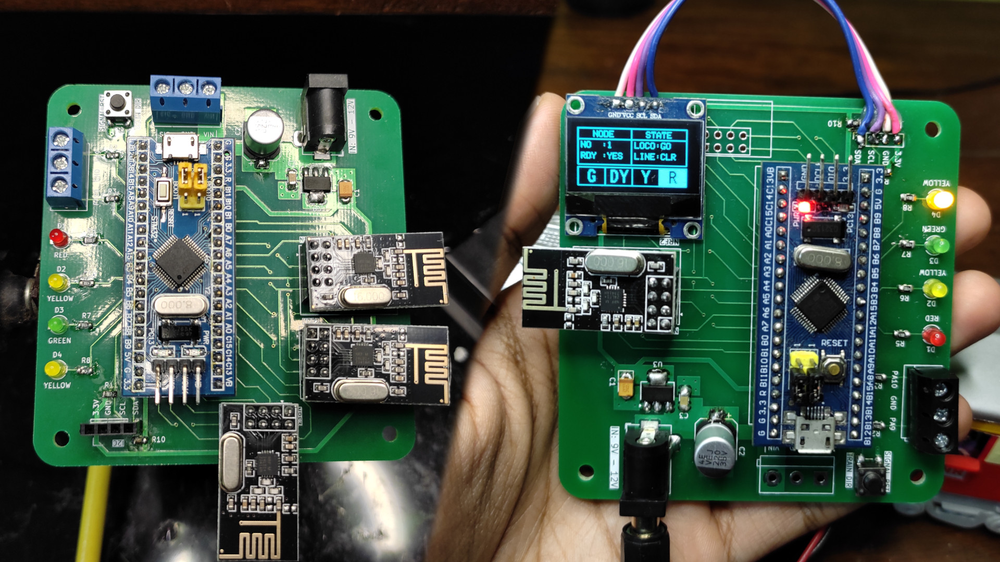

# OTAPS - Open Train Accident Prevention System
This repository contains schematic, PCB and wiring files for OTAPS.

## Directory info:
1. ```Wiring``` contains the schematic for wiring signal node.
2. ```WiringLocomotiveUnit``` contains the schematic for wiring the locomotive unit.
3. ```Nodes``` contains the schematic and PCBs files for the PCBs.

# DETAILS:
I created this project for the **Circuit Digest 2024 IoT & Edge AI Project Challenge**.
The firmware for the signal and locomotive units is available at this repository: https://github.com/Ozonised/OTAPS_Firmware
The project details including features, working protocol, build guide and code explanation can be found on this page:

### NOTE:
Both signal and locomotive units utilise the same PCB.
